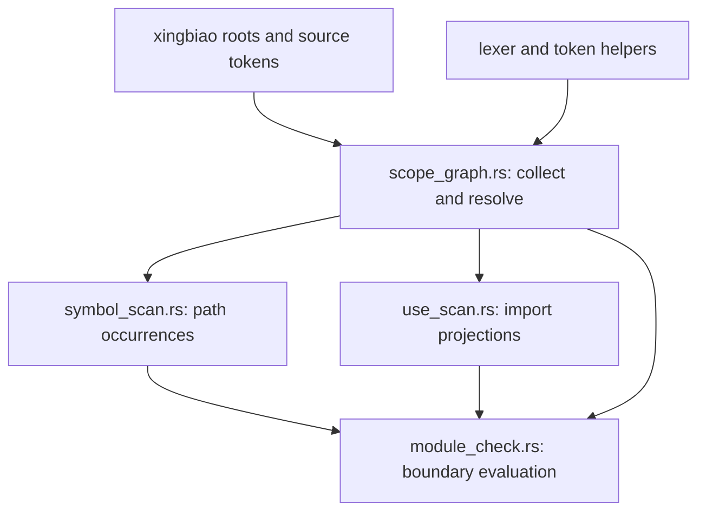

# Design: typed name resolution for guibiao inline paths

This document records a proposed architecture, not an implementation contract already shipped. Measurements are summarized in [measurements.md](measurements.md); the full executed commands and outputs are preserved in [measurements.raw.log](measurements.raw.log).

## a. Ask one stable question

For every path occurrence the scanner recognizes, ask: **what binding does its first identifier resolve to from this lexical scope, in this edition, with this path root form?** Return a canonical `BindingId` with namespace and origin, a set of competing bindings, or `CannotJudge(reason)`. The confinement matcher then compares the resolved path with the declared prefix, and the existing observation policy decides whether this external binding is in default or strict scope.

This replaces separate “did a use map happen to contain this alias?”, “is this prefix external?”, and “does the preceding token make `::` global?” answers. New syntax that reaches the same first-name lookup follows the same binding graph. New resolver behavior therefore changes the graph builder or a declared boundary, not an ever-growing list of spellings. R1 demonstrates why the input must include inherited scope; R4 and R6 show why lexical origin and path context must be part of the answer.

## b. Scope-table shape and resolution rules

Proposed data model:

- `ModuleScope`: canonical module id, package edition, parent module, and directly declared items keyed by name and Rust namespace. Each item records visibility, item kind, source span, and canonical local target.
- `NamedBinding`: each `use` leaf, alias, and `pub use`, with the spelling visible in that scope, source scope, namespace where observable, visibility, and resolved target. Private imports are visible to descendant scopes according to the module relationship; they are not promoted to siblings. Public re-exports contribute to the exported-name closure.
- `GlobEdge`: source scope, target module or external root, visibility, and source span. A glob is an edge, not a guessed list of identifiers.
- `ExternPrelude`: canonical dependency crate names and Cargo rename aliases, the `std`/`core`/`alloc` roots, and any `extern crate dep as alias` declaration at its declaring scope. Record the package edition alongside the roots because path-root and identifier rules are edition-sensitive.
- `BindingCandidate`: canonical target plus origin (`local item`, `named import`, `glob import`, `extern prelude`, or `sysroot`) and visibility path. Same-identity candidates collapse; distinct candidates remain distinguishable.

Populate explicit module declarations, named imports, aliases, and re-export targets first. Resolve glob edges over the module graph until no binding set changes (a visited/fixed-point worklist makes cycles finite). `use super::*` therefore copies names visible from the actual parent scope, including private imports visible to the child; this is the scope R1 compiles and the release scanner misses.

Lookup order is lexical and namespace-aware: an applicable direct item or explicit named binding in the nearest scope wins over glob candidates; one canonical glob candidate resolves; identical candidates from multiple routes coalesce; distinct candidates remain ambiguous. The extern prelude is consulted only when no applicable lexical binding wins. A leading `::` is interpreted according to the occurrence's edition and syntactic path position, not merely because the previous token is non-identifier. An ambiguous used head returns cannot-judge (exit 2) with the competing names; it is never selected arbitrarily. Cargo rejects some ambiguous uses, but that behavior was not separately measured here, so the exact accepted ambiguity set remains an implementation probe and an explicit bound until pinned.

The mandated matrix measures editions 2018, 2021, and 2024. Edition 2015 path-root behavior was not measured; until a Cargo probe is added, a 2015 occurrence requiring external-versus-crate-root disambiguation is a declared cannot-judge bound. The matrix also does not measure block-local `use` items; if the scanner cannot prove the module-scope result is unaffected by a nested lexical binding, it must return cannot-judge rather than claim a match or a clean result.

## c. One table, all consumers

Introduce one guibiao-local `scope_graph.rs` owner. It reads the resolved package roots/source units and token facts, owns the one use-tree parser, builds an immutable `ScopeGraph`, and exposes `resolve_path_head`, `resolve_prefix`, and collected import records. `symbol_scan.rs` enumerates path occurrences and asks the graph for their binding; `use_scan.rs` projects the graph's import records; `module_check.rs` builds the graph and orchestrates both consumers. The graph never imports a consumer, so there is no back-edge.

The graph becomes the sole input to each of these current consumers:

| Current consumer | Proposed migration |
|---|---|
| `InlinePrefix::of` and `require_names_something` in `module_check.rs` | Parse and validate prefix segments with the same edition-aware name table; resolve the prefix's root binding and store its canonical identity before building the boundary/rule key. Keep path spelling and module-existence validation as separate validation results, not another name resolver. |
| `symbol_scan.rs` `ResolveCtx.defs` and per-file `use_maps` | Replace the crate-wide ad hoc type/public-use closure and `(module, alias)` map with `ScopeGraph` lookups that return typed bindings. Preserve source locations for findings. |
| `glob_import_paths` / `glob_bases` hazard walks | Consume the same resolved `GlobEdge` and re-export closure used by lookup; retain the stated over-reaction perimeter where a glob's possible names cannot be enumerated. |
| `check_inline_confinement`, `check_module_boundary`, `check_one_root`, and `local_item_definitions` | Build the graph once per package/root analysis, then pass scope ids and resolved path occurrences through confinement checks. Do not reconstruct scope facts per rule. |
| `use_scan.rs` `imports_with_importers` and `external_imports_with_importers` | Read collected import facts from the graph. Keep one use-tree parser/walker in the shared scanner path; remove byte-identical `use_trees_with_modules` copies and the third glob-specific traversal. |
| `use_statements` / `pub_use_statements` | Become projections over the same import records, not independent token walks. |

The shared representation remains guibiao-local. It does not import `syn`, does not call `hunyi::resolve`, and does not turn the two engines into one implementation. The repo decision preserves that quarantine; this proposal keeps it intact.

## d. Canonical identity and strict-external policy

Resolution and observation are separate stages. `std::time` and `::std::time` resolve to the same sysroot binding when each spelling is legal in context, and `foo` / `::foo` resolve to the same dependency binding when the edition and source scope make them equivalent. Store the canonical binding path in the normalized prefix and `RuleKey`; the R2 cross-spelling baseline comparison shows the current key instead retains `std::time` versus `::std::time` and leaves a stale baseline.

R3's target preserves the declared default policy: an un-`use`d external dependency path is outside default observation and inside `.strict_external()`. Therefore both `md5x::compute()` and `::md5x::compute()` are default-clean and strict violations. The current release gives those spellings different default answers; the older checker gives the desired mode split for both. A local item shadow such as R4 resolves to that local item before the extern prelude, even in strict mode. A `::` prefix targets the external binding and is not a wildcard for the local module.

This keeps `.strict_external()` source-compatible and meaningful. It changes no builder method signature. Normalization can change recorded `RuleKey` identities; R2 therefore requires baseline migration and is BREAKING.

## e. Edition-aware prefix heads

Give boundary-prefix validation its own in-crate edition table, separate from `lexer::is_rust_keyword`, which is retained for macro-negation token handling. The table categories are strict keywords, reserved keywords, weak keywords, and `_` (never a path head). Read the category/edition source from the Rust Reference keyword and identifier tables; raw identifiers are accepted where Rust permits them and normalize to the underlying identifier name.

The measured matrix establishes: `gen` is an ordinary head in 2018/2021 and needs raw spelling in 2024; `async`, `dyn`, and `try` were exercised as raw source identifiers in all three editions and the raw 2021 boundary spellings resolve; `union` works as a weak keyword; `_::f()` fails Cargo in all three editions. Target behavior: accept `gen` in 2018/2021, require `r#gen` for a 2024 boundary prefix and suggest that exact repair; require `r#async`, `r#dyn`, and `r#try` for strict-keyword heads and suggest the raw form; reject `_` without a raw suggestion; accept `union`. The raw `async`/`dyn`/`try` probes were run in 2021 only, so target acceptance in 2018 and 2024 remains bounded until implementation adds those edition probes.

Keep a versioned structured snapshot of the Rust Reference categories as the only data source for the Rust lookup table; generate the Rust table from it instead of hand-maintaining a second list. A parity check compares every generated entry against the source snapshot in both directions, and generated Cargo probes exercise every category/edition row against rustc. Record the Reference URL and edition in the snapshot. This makes code and the checked-in source snapshot agree mechanically; no measurement here compares a live Reference page with the snapshot, so additions to a future edition remain a maintenance bound and require updating the snapshot and probe corpus together. Sources: [Rust Reference: Keywords](https://doc.rust-lang.org/reference/keywords.html), [Rust Reference: Identifiers](https://doc.rust-lang.org/reference/identifiers.html), and [Rust 2024 edition guide: `gen`](https://doc.rust-lang.org/edition-guide/rust-2024/gen-keyword.html).

## f. Leading `::` is a syntactic position, not a token heuristic

The scanner must distinguish a root-qualified path at a path start from `::` that continues a qualified type or generic path. R6 compiles `<W>::md5x()` as an associated function and the target is clean in both modes; treating the preceding `>` as evidence of a global root is a false positive. Track delimiter/path context while reading an occurrence, including angle-bracket qualification and turbofish closure, then pass a root-form enum to the resolver. If the token scanner cannot classify a qualified form, return cannot-judge under the stated UFCS bound rather than reinterpret it as an extern-prelude root.

The probe measures `<W>::md5x()`; `<T as Trait>::method`, nested projections, and other type-directed qualified paths were not measured and remain declared bounds (see g).

## g. Observation bounds retained or made explicit

The resolver does not expand Rust or proc-macro output and does not infer types. Keep these as explicit bounds, each with a negative Cargo fixture and a PINNED-BY test in the eventual spec:

| Bound | Reason / pin to add or retain |
|---|---|
| Macro-generated names/items and names assembled by macro fragments or proc macros | Source tokens do not contain the generated binding. Retain `inline_in_macro_body_alias_is_a_bound` and `a_prefix_naming_a_macro_generated_item_is_refused`; add `inline_macro_generated_name_is_a_cannot_judge_bound` for a call that exists only after expansion. |
| `#[cfg]`-gated alternatives | Scan the declared cfg-blind source union; do not claim that an inactive branch was compiled away. Add `inline_cfg_gated_calls_are_observed_as_written` to pin the source-union behavior. |
| External-crate re-exports | Foreign AST is not in the package scope graph. Retain `inline_foreign_reexport_of_the_confined_path_is_a_bound`. |
| Receiver methods and type-directed UFCS, including `<T as Trait>::method` | No type inference. Retain `inline_receiver_method_read_is_a_bound`; add `inline_ufcs_path_is_a_cannot_judge_bound` for a valid qualified call the token resolver cannot classify. R6 itself is a measured false positive to close, not a claim of UFCS support. |
| Function/block-local imports not represented in the module table | The mandated measurements do not exercise these scopes. Add `inline_block_local_use_is_a_cannot_judge_bound` and return cannot-judge where such a binding could change the head. |
| Ambiguous globs and edition-2015 root behavior | Not measured in this matrix. Add `inline_ambiguous_glob_head_is_a_cannot_judge_bound` and `inline_edition_2015_root_path_is_a_cannot_judge_bound`; return cannot-judge until focused Cargo probes establish the exact supported shape. |
| `extern crate dep as alias` path calls | The scope table records this binding, but the current spec calls it a bound even under strict-external. Do not widen its observation in this change without a real Cargo probe and a PINNED-BY scenario; the existing bound stays in force meanwhile. |

These bounds are limits of the proposed source observer, not claims that the Rust compiler cannot resolve the cases.

## h. Keep the syn quarantine

No dependency on `syn` is proposed. Guibiao keeps a token/source scanner and its own typed scope graph; hunyi keeps its syn-AST resolver. Shared prose can describe the same architectural question, but shared implementation would violate the accepted `PROJECT.md` decision. This is an accepted repository boundary, not a runtime claim, so no behavioral probe is relevant. The new module stays inside guibiao and depends only on guibiao's existing package inputs.

## i. Compatibility against v0.7.1

The comparison is per mandated probe, not a claim about unmeasured inputs:

| Scenario | Target relative to v0.7.1 | Classification |
|---|---|---|
| R1 parent private use through `super::*` | Keep 1/1; v0.7.1 already reports it, release/0.8.0 misses it | BREAKING against the current release: closes a false negative. |
| R2 `std::time` prefix | Keep 1/1; unchanged from v0.7.1 | Patch by itself. |
| R2 `::std::time` prefix and cross-spelling baseline | Change from v0.7.1's clean 0/0 to 1/1 and normalize the key | BREAKING: closes a false negative and changes baseline identity. |
| R3 bare dependency call | Keep default 0 / strict 1 | No behavior change. |
| R3 leading-root dependency call | Change default 1 / strict 1 in release/0.8.0 to 0 / 1; v0.7.1 already has 0 / 1 | Patch: removes a default over-reaction and preserves the spec's strict-only bound. |
| R4 local module shadows same-name dependency | Keep 0/0; v0.7.1 already has this answer | Patch-class correction to the pre-change constitution error; no adopter action. |
| R5 `gen` prefix in 2018/2021 | Keep 1/1 | No behavior change. |
| R5 `gen` prefix in 2024 | Require raw prefix and report 2/2 with a `r#gen` repair; v0.7.1 reports 1/1 for the unraw prefix | BREAKING if an adopter must rewrite the boundary string. |
| R5 `async`, `dyn`, and `try` unraw prefixes in 2018/2021/2024 | Report 2/2 with a raw-form repair; v0.7.1 reports 1/1 | BREAKING if an adopter must rewrite an existing boundary string. |
| R5 `_` prefix in 2018/2021/2024 | Refuse 2/2; v0.7.1 silently returns 0/0 although Cargo rejects `_::f()` | BREAKING: an invalid ignored boundary now requires repair. |
| R5 weak `union` prefix | Keep 1/1 | No behavior change. |
| R5 raw `r#gen`, `r#async`, `r#dyn`, `r#try` probes | Keep 1/1 | No behavior change. |
| R6 `<W>::md5x()` | Keep default clean; change strict from 1 to 0 | Patch-class false-positive removal; the measured fixture requires no adopter repair. |

The complete exit-code comparison and the R2 baseline create/cross-spelling experiment are in the measurement artifacts. `CHANGELOG.md` must mark R1/R2 (and the R5 input rewrite if implemented) **BREAKING**. Its Migration section should say: rerun the check and regenerate baselines for the newly observed inherited private import and normalized prefix keys; use raw-identifier spelling for keyword heads where the edition requires it. It should state explicitly that un-`use`d external dependency paths remain strict-only. Do not label the behavior as a patch merely because the code diff is internal.

## j. Requirement/scenario, pins, and stale prose

The draft [spec.md](spec.md) updates requirement and scenarios together. It makes the first path head resolve from the occurrence's actual scope, spells out inherited private uses, sibling isolation, local alias/type/pub-use closure, canonical root identity, and mode policy. Add PINNED-BY references to the five existing `per_target_corpus.rs` tests:

1. `an_inline_module_use_resolves_from_its_enclosing_module`
2. `an_inline_module_use_does_not_leak_to_sibling_modules`
3. `an_inline_module_type_alias_resolves_under_its_inline_path`
4. `an_external_prefix_disambiguates_with_leading_colons`
5. `a_prefix_starting_with_a_keyword_is_refused`

Add a new test for R1's inherited private import, and pin the existing cross-module public-re-export test `inline_resolves_a_cross_module_local_reexport` to the pub-use scenario. The keyword requirement names the Rust Reference edition table as its owner rather than an open-ended “keyword” set. Amend both requirement text and scenarios in the same implementation change.

Rewrite the stale `resolve_head`, `use_trees_with_modules`, and `use_statements` docs where their described lookup/walk is removed or moved; delete `_current_module` once the new lookup no longer needs it. Keep one use-tree walk implementation. For R6, update comments that say a preceding non-identifier implies leading `::`.

## k. Put the md5x fixture under its owner

`RootProbe::Drop` removes only its own `dir`; the current `../md5x_dep` fixture is a sibling outside that owned directory and survives cleanup, so concurrent tests with the same PID can collide. Place `md5x_dep/Cargo.toml` and `md5x_dep/src/lib.rs` beneath `probe.dir`, set the dependency path to `md5x_dep`, and let the existing root cleanup remove the entire fixture. Acceptance is two concurrent instances of the exact test followed by absence of the unique root; the negative mutation must bypass or remove the root cleanup in the engine/fixture setup and show the cleanup assertion catches the leak (do not mutate only the expected fixture contents).
