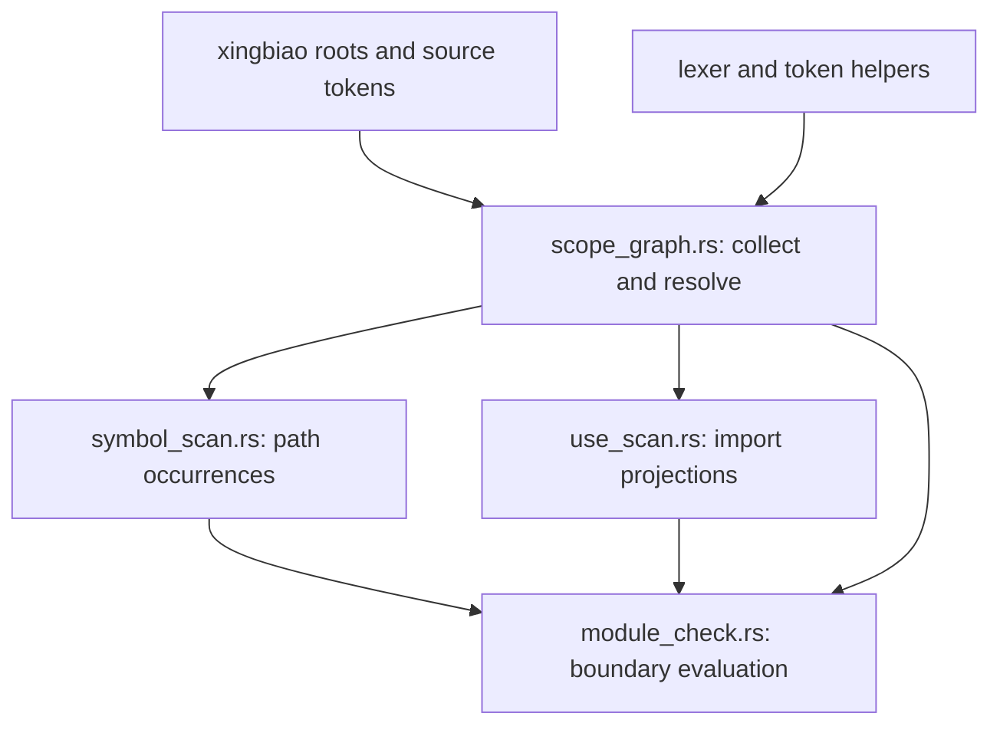

# Design: typed name resolution for guibiao inline paths

This document records a proposed architecture, not an implementation contract already shipped. Measurements are summarized in [measurements.md](measurements.md); the executed commands and outputs are preserved in [measurements.raw.log](measurements.raw.log) (first round) and [measurements.revision.raw.log](measurements.revision.raw.log) (revision round).

**Principle for every answer below.** A shape that v0.7.1 or release/0.8.0 passes or reacts to does not become exit 2 unless a real, reachable ambiguity is measured for it. Where the scanner cannot see what decides a binding, the answer is a declared bound — an under-reach that stays silent, or an over-reaction the spec already states — not a new refusal.

## a. Ask one stable question

For every path occurrence the scanner recognizes, ask: **what binding does its first identifier resolve to from this lexical scope, in this edition, with this path root form?** Return a canonical `BindingId` with namespace and origin, or a set of candidate bindings. The confinement matcher then compares the resolved path with the declared prefix, and the existing observation policy decides whether this external binding is in default or strict scope.

This replaces separate “did a use map happen to contain this alias?”, “is this prefix external?”, and “does the preceding token make `::` global?” answers. New syntax that reaches the same first-name lookup follows the same binding graph. New resolver behavior therefore changes the graph builder or a declared boundary, not an ever-growing list of spellings. R1 demonstrates why the input must include inherited scope; B3/B4 why it must include block scope; R4 and R6 why lexical origin and path context must be part of the answer.

## b. Scope-table shape and resolution rules

Proposed data model:

- `Scope`: a canonical id, its parent scope, and its kind — `Module` (a file or inline `mod`, with canonical module path) or `Block` (a block expression's `{ … }`, identified by its opening byte offset). Each scope records its directly declared items keyed by name and Rust namespace, with item kind, visibility, source span and canonical target.
- `NamedBinding`: each `use` leaf, alias, and `pub use`, recorded **in the scope whose braces enclose it**, with the spelling visible in that scope, namespace where observable, visibility, and resolved target. Private imports are visible to descendant scopes according to the module relationship; they are not promoted to siblings. Public re-exports contribute to the exported-name closure.
- `GlobEdge`: source scope, target module or external root, visibility, and source span. A glob is an edge, not a guessed list of identifiers.
- `ExternPrelude`: canonical dependency crate names and Cargo rename aliases, the `std`/`core`/`alloc` roots, and any `extern crate dep as alias` declaration at its declaring scope, with the package edition.
- `BindingCandidate`: canonical target plus origin (`local item`, `named import`, `glob import`, `extern prelude`, or `sysroot`) and visibility path. Same-identity candidates collapse; distinct candidates remain distinguishable.

**Block scopes are lexical, and only two kinds of brace open one.** A module body — a file, or an inline `mod name { … }` — and a block expression: a fn body (including a method body inside an `impl` or `trait`), a nested `{ … }`, an `unsafe`/`async`/`const` block, a closure body, a match-arm block, and a `const` or `static` initializer block. Every other brace is **transparent** to name binding and records nothing: an `impl` or `trait` body holds associated items, reached only through `Self::` or a type path, so they never shadow a bare path head (row H1); an `enum`, `struct` or `union` body holds variants and fields, reached only through the type (row H3); an `extern` block's items are declared in the enclosing module, as item collection already reads them. A `use` or item can stand only at item position, which occurs directly inside a module body, a block, or one of those transparent braces. So a `use` or item directly inside a module body or a block is recorded in that scope; a member of an `impl`, `trait`, `enum`, `struct` or `union` body is not recorded at all; and an `extern` block's items are recorded in the scope enclosing the block. `path_occurrences` already tracks brace depth and the `mod name { … }` stack; the scope walk classifies each `{` by the item head before it (`impl`, `trait`, `enum`, `struct`, `union` or `extern` opens no scope) and treats every other brace as a block. A brace in which no item can stand — a struct literal, a `match` body — then opens a block that holds no binding, which changes no lookup, so the classification needs no expression grammar. Lookup walks the occurrence's scope chain innermost-first. A block `use` covers its whole block, including text before it (row G), and ends at its closing brace (B3/B4). The same walk records block-local items, which is what makes F's local `struct Command` shadow the module-level import. A `use` inside a macro-invocation body stays under the existing alias-in-macro bound; macro token trees are delimiter-balanced, so they cannot unbalance the scope walk.

Populate explicit module declarations, named imports, aliases, and re-export targets first. Resolve glob edges over the module graph until no binding set changes (a visited/fixed-point worklist makes cycles finite). `use super::*` therefore copies names visible from the actual parent scope, including private imports visible to the child; this is the scope R1 compiles and the release scanner misses.

**Lookup order** is lexical and namespace-aware: an applicable item or explicit named binding in the nearest scope wins over glob candidates; one canonical glob candidate resolves; identical candidates from multiple routes coalesce. The extern prelude is consulted only when no applicable lexical binding wins. A leading `::` is interpreted according to the occurrence's edition and syntactic path position (f).

**More than one candidate is a union, not a refusal.** Where one scope holds two distinct candidates for a name, rustc either rejects the used name (E0659, row E1) or only one of them is compiled, which only `#[cfg]` can arrange. The scanner reads source cfg-blind, under the existing `external-crate-confinement/cfg-gated-code-is-observed-as-written-a-stated-bound`, so it observes both: the occurrence reacts if **any** candidate resolves under the prefix. Row E6 is why this matters — every revision keeps only the last `use`, and on Linux that drops the arm that is compiled. Every glob row (E1–E5) already reacts through the glob-hazard reaction and keeps doing so. No candidate set produces exit 2.

**Edition 2015 is modeled, not refused.** In a 2015 package, a `use` path and a path beginning `::` resolve from the crate root scope, whose bindings include its `extern crate` items; other expression paths resolve lexically as in later editions. Rows D show the rule is decidable from the package edition alone and that every revision misses both the `::clock::now()` call and the 2015 `use clock::now` import (0/0 where Rust calls into `crate::clock`).

**The resolver has no cannot-judge of its own.** Exit 2 stays where it is today: unreadable source (lexing failure, a `use` tree past the depth cap) and constitution errors in the prefix. Everything the scanner cannot see is one of the declared bounds in g.

## c. One table, all consumers

Introduce one guibiao-local `scope_graph.rs` owner. It reads the resolved package roots/source units and token facts, owns the one use-tree parser, builds an immutable `ScopeGraph`, and exposes `resolve_path_head`, `resolve_prefix`, and collected import records. `symbol_scan.rs` enumerates path occurrences and asks the graph for their binding; `use_scan.rs` projects the graph's import records; `module_check.rs` builds the graph and orchestrates both consumers. The graph never imports a consumer, so there is no back-edge.

The graph becomes the sole input to each of these current consumers:

| Current consumer | Proposed migration |
|---|---|
| `InlinePrefix::of` and `require_names_something` in `module_check.rs` | Validate the prefix head by the rule in e, normalize raw segments, resolve the prefix's root binding and store its canonical identity before building the boundary/rule key. Keep path spelling and module-existence validation as separate validation results, not another name resolver. |
| `symbol_scan.rs` `ResolveCtx.defs` and per-file `use_maps` | Replace the crate-wide ad hoc type/public-use closure and the `(module, alias)` map — whose last-written entry wins file-wide (B3/B4) — with `ScopeGraph` lookups over the occurrence's scope chain. Preserve source locations for findings. |
| `glob_import_paths` / `glob_bases` hazard walks | Consume the same resolved `GlobEdge` and re-export closure used by lookup; retain the stated over-reaction perimeter where a glob's possible names cannot be enumerated. |
| `check_inline_confinement`, `check_module_boundary`, `check_one_root`, and `local_item_definitions` | Build the graph once per package/root analysis, then pass scope ids and resolved path occurrences through confinement checks. Do not reconstruct scope facts per rule. |
| `use_scan.rs` `imports_with_importers` and `external_imports_with_importers` | Read collected import facts from the graph. Keep one use-tree parser/walker in the shared scanner path; remove byte-identical `use_trees_with_modules` copies and the third glob-specific traversal. |
| `use_statements` / `pub_use_statements` | Become projections over the same import records, not independent token walks. |

The shared representation remains guibiao-local. It does not import `syn`, does not call `hunyi::resolve`, and does not turn the two engines into one implementation. The repo decision preserves that quarantine; this proposal keeps it intact.

## d. Canonical identity and strict-external policy

Resolution and observation are separate stages. `std::time` and `::std::time` resolve to the same sysroot binding when each spelling is legal in context, and `foo` / `::foo` resolve to the same dependency binding when the edition and source scope make them equivalent. Store the canonical binding path in the normalized prefix and `RuleKey`; the R2 cross-spelling baseline comparison shows the current key instead retains `std::time` versus `::std::time` and leaves a stale baseline.

**R3 is settled: the default-mode contract stays as v0.7.1 and the active spec state it.** An un-`use`d external dependency path is outside default observation and inside `.strict_external()`, so both `md5x::compute()` and `::md5x::compute()` are default-clean and strict violations. release/0.8.0 gives the two spellings different default answers; this change restores v0.7.1's split for both. The 2015 rows D follow the same rule (`md5x` and `::md5x` both 0/1). A local item shadow such as R4 resolves to that local item before the extern prelude, even in strict mode. A `::` prefix targets the external binding and is not a wildcard for the local module.

This keeps `.strict_external()` source-compatible and meaningful. It changes no builder method signature. Normalization can change recorded `RuleKey` identities; R2 therefore requires baseline migration and is BREAKING.

## e. Boundary-prefix heads: can this head name a crate or module?

A boundary prefix is a **name**, not Rust source, so the question it is held to is whether its first segment can name a crate or module — not whether the source edition would need `r#` to write it. The first round measured that every revision up to v0.7.1 matches an unraw `async`, `dyn`, `try` or `gen` prefix against source that writes `r#async` and so on (1/1 in every edition); the revision round measured the raw prefixes in all three editions (1/1). Requiring `r#head` would be BREAKING and buy nothing.

The rule:

- Strip `r#` from every segment first; match and identity use the unraw name, so `async` and `r#async` are one prefix and one `RuleKey`.
- Refuse a head that can never name a crate or module. The set is finite, edition-independent, and owned by the Rust Reference's identifier grammar ([Identifiers](https://doc.rust-lang.org/reference/identifiers.html)): `_` is not an identifier, and `crate`, `self`, `super` and `Self` are the keywords that cannot be written as raw identifiers. So:
  - `_` and `r#_` — refused, no suggestion.
  - `r#crate`, `r#self`, `r#super`, `r#Self` — refused; the suggestion is the unraw spelling when that is a valid prefix (`r#crate::clock` → `crate::clock`).
  - `self`, `super`, `Self` bare — refused as today: each is relative to a module or type a declaration does not have.
  - `::crate` — refused as today; `crate` stands only at the start of a path.
  - bare `crate` — accepted as today, the crate-root form.
- Every other head, keyword or not, in any edition, is accepted bare or raw.

Rows N measure every member: each raw spelling builds 101 as source, release/0.8.0 already refuses all of them except `_::clock`, and `_`/`_::clock` is accepted by every revision. So against release/0.8.0 the one answer that changes is `_`, from silently accepted to exit 2 — an observable misconfiguration, since `_::f()` never compiles.

`lexer::is_rust_keyword` returns to its one remaining use, the macro-negation test in the lexer. The prefix-head test in `path_vocab.rs` stops calling it and names the five-member set directly. There is no keyword table, no Reference snapshot, no generator and no parity check.

## f. Leading `::` is a syntactic position, not a token heuristic

The scanner must distinguish a root-qualified path at a path start from `::` that continues a qualified type or generic path. R6 compiles `<W>::md5x()` as an associated function and the target is clean in both modes; treating the preceding `>` as evidence of a global root is a false positive. Track delimiter/path context while reading an occurrence, including angle-bracket qualification and turbofish closure, then pass a root-form enum to the resolver.

**A path beginning with `<` has no crate-root head and is not resolved.** `<T>::f()` and `<T as Trait>::method()` are type-directed: the associated item is chosen by the type, which needs inference the scanner does not perform. Rows C1–C4 measure that every revision already reports none of them (0/0) and refuses none. They stay 0/0 as a declared under-reach under the existing `inline-symbol-path-confinement/a-receiver-method-read-is-a-documented-bound`, whose spec text already names UFCS (`<Type as Trait>::now()`). The spec scenario for that bound gains a second `PINNED-BY` for the qualified form (j). It is not a cannot-judge.

## g. Observation bounds retained or made explicit

The resolver does not expand Rust or proc-macro output and does not infer types. Each bound is one of three kinds: **under-reach** (silent, exit 0 over a shape Rust would report), **over-reaction** (reports a shape Rust would not), or **refuse** (exit 2). No bound in this change is a new refusal.

| Bound | Kind | Id / pin |
|---|---|---|
| Aliases introduced inside an unexpanded macro body; names assembled by `paste!`/proc macros | under-reach | Spec observation bounds (2)(3); retain `inline_in_macro_body_alias_is_a_bound`. No new pin. |
| A `crate::` prefix naming a macro-generated item | refuse (exit 2) — **existing, unchanged** | `…/a-prefix-naming-a-macro-generated-item-is-refused-a-stated-bound`, `a_prefix_naming_a_macro_generated_item_is_refused`. |
| `#[cfg]` alternatives, including two cfg-exclusive bindings for one name | over-reaction (both arms observed) | Inherited `external-crate-confinement/cfg-gated-code-is-observed-as-written-a-stated-bound`; add ordinary scenario pin `inline_cfg_alternative_uses_are_both_observed` (E6). |
| External-crate re-exports | under-reach | `…/an-external-crate-re-export-is-a-documented-bound`, retained. |
| Receiver methods and every path beginning with `<` (`<T>::f`, `<T as Trait>::m`) | under-reach | `…/a-receiver-method-read-is-a-documented-bound`, retained; add second pin `inline_qualified_path_is_the_type_directed_bound` (C1/C2) with a mutation record. |
| A glob whose resolved module holds a prefix-resolving alias or re-export it may not import | over-reaction | `…/a-glob-reacts-to-any-alias-or-re-export-beneath-its-resolved-module-a-stated-bound`, retained. |
| `extern crate dep as alias` path calls under strict-external | under-reach | `…/an-extern-crate-rename-is-a-stated-bound-under-strict-external`, retained. Not re-measured; not widened in this change. |
| Un-`use`d fully-qualified external call under the default | under-reach (policy) | `…/the-fully-qualified-external-call-is-a-stated-bound-under-the-default`, retained (d). |
| A generic parameter named like an import (`fn f<Command: Default>() -> Command { Command::default() }`, and an `impl<T>`/`trait<T>` parameter used in a method body) | over-reaction (the import is read, and a call through the parameter reports under the import's path) | New: `inline-symbol-path-confinement/a-generic-parameter-named-like-an-import-is-read-as-the-import-a-stated-bound`, pinned by `inline_generic_parameter_named_like_an_import_is_read_as_the_import` (H2), with a mutation record. |

Withdrawn from the previous draft, each because a measurement answered it: the block-local-use cannot-judge (block scopes are modeled, b), the ambiguous-glob cannot-judge (rustc rejects a used ambiguous name, and cfg alternatives take the union, b), the edition-2015 cannot-judge (the root rule is modeled, b), the UFCS cannot-judge (the existing under-reach bound, f), and the macro-generated-name cannot-judge (it stays the existing under-reach).

**Generic parameters are declared, not modeled.** A generic parameter binds from its `<…>` list over the item's signature, `where` clause and body, and for `impl<T>` and `trait<T>` over every method body inside a brace this design keeps transparent (b). Recording them would need a third scope kind that covers a signature and every member body of a brace that is otherwise not a scope, plus a reading of the parameter list that tells a type parameter from a lifetime or a `const` parameter. What leaving them out costs is an over-reaction and never a false negative: a head that names a parameter is read as whatever the enclosing module binds, so it reacts only when an import of the same name resolves under the prefix — the shape in H2, which v0.7.1 and release/0.8.0 already report. A declared over-reaction is the disposition this design gives every shape whose binder the scanner does not read (the glob row above), so this one takes it too, with H2 as its pin.

These bounds are limits of the proposed source observer, not claims that the Rust compiler cannot resolve the cases.

## h. Keep the syn quarantine

No dependency on `syn` is proposed. Guibiao keeps a token/source scanner and its own typed scope graph; hunyi keeps its syn-AST resolver. Shared prose can describe the same architectural question, but shared implementation would violate the accepted `PROJECT.md` decision. This is an accepted repository boundary, not a runtime claim, so no behavioral probe is relevant. The new module stays inside guibiao and depends only on guibiao's existing package inputs.

## i. Compatibility against v0.7.1

Per measured probe, not a claim about unmeasured inputs. "Adopter acts" is the versioning rule's test for BREAKING.

| Scenario | v0.7.1 → target | Classification |
|---|---|---|
| R1 parent private use through `super::*` | 1/1 → 1/1 (release/0.8.0 regressed to 0/0) | No change against v0.7.1; restores it. |
| R2 `std::time` prefix | 1/1 → 1/1 | No change. |
| R2 `::std::time` prefix and cross-spelling baseline | 0/0 → 1/1, key normalized | BREAKING: closes a false negative and changes baseline identity. |
| R3 bare and `::` dependency call | 0/1 → 0/1 for both (release/0.8.0 had 1/1 for `::`) | No change against v0.7.1. |
| R4 local module shadows same-name dependency | 0/0 → 0/0 | No change. |
| R5 `gen`/`async`/`dyn`/`try`/`union`, bare or raw, every edition | 1/1 → 1/1 (release/0.8.0 refused the bare keyword heads) | No change against v0.7.1. The `[Unreleased]` entry that says a keyword head is exit 2 is rewritten to the finite set in e. |
| R5 `_` prefix, every edition and both source shapes | 0/0 or 1/1 → 2/2 | BREAKING by the rule: an adopter with such a boundary must rewrite it. The boundary never named anything that compiles. |
| N `r#crate`, `::crate`, `self`, `super`, `Self` heads, bare or raw | v0.7.1 accepted; release/0.8.0 already refuses (2/2) → 2/2 | Already BREAKING in `[Unreleased]` from earlier commits; unchanged by this design. |
| B3/B4 block-local `use` of a name the module also imports | one prefix 0/0 → 1/1; the other loses a false finding | BREAKING: closes a false negative. |
| E6 cfg-exclusive named imports of one name | 0/0 → 1/1 for the arm not written last | BREAKING: closes a false negative. |
| D edition-2015 `::local` path and 2015 `use local::…` | 0/0 → 1/1 | BREAKING: closes a false negative. |
| D edition-2015 `::md5x` prefix | 0/0 → 0/1 | BREAKING (strict only): closes a false negative under `.strict_external()`. |
| F block-local item shadows a module import | 1/1 → 0/0 | Patch-class: removes a false positive, no adopter action. |
| A, A2, B, G block-local `use` | unchanged | No change. |
| H1 associated `const`, H3 enum variant named like an import | 1/1 → 1/1 | No change; the braces they sit in open no scope (b). |
| H2 generic parameter named like an import | 1/1 → 1/1 | No change; declared over-reaction (g). |
| C1–C4 qualified paths | 0/0 → 0/0 | No change; declared under-reach. |
| E1–E5 globs | 1/1 → 1/1 | No change; glob hazard. |
| R6 `<W>::md5x()` | 0/1 → 0/0 | Patch-class false-positive removal. |

`CHANGELOG.md` must mark R2, `_`, B3/B4, E6 and the 2015 rows **BREAKING**. Its Migration section should say: rerun the check and regenerate baselines for normalized prefix keys and for newly observed block-scoped, cfg-alternative and edition-2015 calls; replace a `_` prefix head. It should state explicitly that un-`use`d external dependency paths remain strict-only, and that keyword heads need no `r#`. Do not label the behavior as a patch merely because the code diff is internal.

## j. Requirement/scenario, pins, and stale prose

The draft [spec.md](spec.md) updates requirement and scenarios together. It makes the first path head resolve from the occurrence's actual scope chain, spells out inherited private uses, block scopes, sibling isolation, local alias/type/pub-use closure, candidate union, the 2015 root rule, canonical root identity, and mode policy. Add PINNED-BY references to the five existing `per_target_corpus.rs` tests:

1. `an_inline_module_use_resolves_from_its_enclosing_module`
2. `an_inline_module_use_does_not_leak_to_sibling_modules`
3. `an_inline_module_type_alias_resolves_under_its_inline_path`
4. `an_external_prefix_disambiguates_with_leading_colons`
5. `a_prefix_starting_with_a_keyword_is_refused` — renamed `a_prefix_head_naming_no_crate_or_module_is_refused`, because its name carries the superseded claim; every `PINNED-BY` citing it changes in the same commit.

Add new tests for R1's inherited private import, B3/B4 block scope, F, H1/H3, E6, the D rows and the `_` head, the H2 pin for the generic-parameter bound (g), and pin the existing cross-module public-re-export test `inline_resolves_a_cross_module_local_reexport` to the pub-use scenario. Each new pin under an ordinary scenario records its negative run in the PR; the new pin under the receiver-method bound adds its mutation record, which `pin_bites` reads from `HEAD`, so it is committed before that gate is run.

Rewrite the stale `resolve_head`, `use_trees_with_modules`, and `use_statements` docs where their described lookup/walk is removed or moved; delete `_current_module` once the new lookup no longer needs it. Keep one use-tree walk implementation. For R6, update comments that say a preceding non-identifier implies leading `::`. Replace "not starting with a keyword (`Self`, `self`, `super`, etc.)" — in the active spec, the `path_vocab.rs` docs and the `[Unreleased]` entry — with the finite set in e.

## k. Put the md5x fixture under its owner

`RootProbe::Drop` removes only its own `dir`; the current `../md5x_dep` fixture is a sibling outside that owned directory and survives cleanup, so concurrent tests with the same PID can collide. Place `md5x_dep/Cargo.toml` and `md5x_dep/src/lib.rs` beneath `probe.dir`, set the dependency path to `md5x_dep`, and let the existing root cleanup remove the entire fixture. Acceptance is two concurrent instances of the exact test followed by absence of the unique root; the negative mutation must bypass or remove the root cleanup in the engine/fixture setup and show the cleanup assertion catches the leak (do not mutate only the expected fixture contents).
